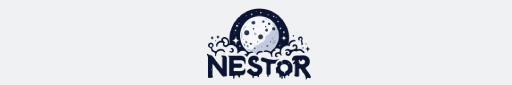

# NestorSDK

Welcome to the **NestorSDK** repository! 🚀🌟 This SDK is crafted to empower developers with enhanced tools and functionalities for creating immersive experiences.

  

## 📖 About

NestorSDK is a powerful SDK designed to enhance the development experience for developers. With its comprehensive set of features, NestorSDK offers a VRCSDK-like experience, But we're bypassing the VRCSDK limitations and providing a more immersive experience.

## 🚀 Getting Started

To get started with NestorSDK, follow these steps:

1. Download the latest version of the NestorSDK package from the [Discord server](https://discord.gg/PaVYAuymgm).
2. Import the NestorSDK package into your project.
3. Enjoy the immersive experience you've been waiting for!

> [!WARNING]\
> The NestorSDK package is not compatible with the VRCSDK. Please ensure that you don't have a com.vrchat.base and com.vrchat.avatars package in your project.

## 🛠️ Key Features and Improvements

- **Avatar Performance Flexibility**: Easily bypass performance and size validation checks for avatars on various platforms, including Quest.
- **Enhanced Parameter Management**: Manage dynamic avatar parameters with increased limits, supporting more complex avatars.
- **VRChat Creator Companion Support**: Seamlessly integrate with VRChat Creator Companion (VCC) with VRChat avatars and base package as Nestor SDK.
- **Tools and Utilities**: A comprehensive set of tools and utilities designed to enhance your development experience.
- **Discord Rich Presence Integration**: Share your VR activity and status in real-time directly on Discord.

> [!CAUTION]
> Please note that the above features are modifications to VRChat's restrictions and may be banned. Use at your own risk.

## 📝 License

This project is licensed under the [UNLICENSE](LICENSE).

---

Thank you for your interest in **NestorSDK**! Let's build something amazing together! 🌍💻
